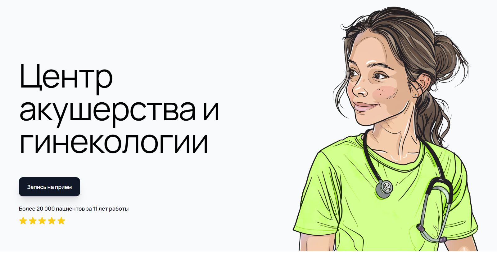

# Телеграм-бот для Частной Клиники



## Обзор

Этот Телеграм-бот разработан для обработки заявок и отзывов пользователей, а также для отправки уведомлений администраторам в групповой чат. Бот обеспечивает простой и интуитивно понятный интерфейс для взаимодействия пациентов с клиникой.

## Возможности

### Для Пользователей

- **Команды и кнопки:**
  - `/start` — Запуск бота и отображение приветственного сообщения.
  - Кнопки:
    - **"Начать"** — Начало взаимодействия с ботом при первом запуске.
    - **"Оставить заявку"** — Сбор данных: имя, номер телефона, комментарий.
    - **"Оставить отзыв"** — Сбор отзыва: оценка от 1 до 5 и текст отзыва.
    - **"Связаться с администратором"** — Отображение контактной информации клиники.

- **Сбор данных:**
  - **Для заявок:**
    - Имя.
    - Номер телефона (ввод вручную).
    - Комментарий (опционально).
  - **Для отзывов:**
    - Оценка от 1 до 5 (выбор кнопками).
    - Текст отзыва.

- **Подтверждения:**
  - **Заявка:** "Ваша заявка принята! Теперь доступна кнопка «Оставить отзыв». Спасибо!"
  - **Отзыв:** "Спасибо за ваш отзыв! Мы ценим ваше мнение."

- **Начальное взаимодействие:**
  - При первом запуске бот отображает только кнопку **"Начать"**.
  - После нажатия **"Начать"** пользователь получает основное меню.
  - При повторных запусках команды `/start` сразу отображается основное меню без кнопки **"Начать"**.

- **Обработка неопределённых сообщений:**
  - Если пользователь отправляет сообщение, не соответствующее ни одному обработчику, бот отвечает с инструкцией использовать команду `/start`.

### Для Администраторов

- **Получение уведомлений в групповом чате:**
  - **Заявки:**
    ```
    📝 *Новая заявка:*
    👤 *Имя:* [Имя]
    📞 *Номер телефона:* [Номер телефона]
    💬 *Комментарий:* [Комментарий]

    Пользователь: @[username]
    ```
  - **Отзывы:**
    ```
    📝 *Новый отзыв:*
    👤 *Пользователь:* [Имя] [Фамилия] (@[username])
    ⭐ *Оценка:* [1-5]
    💬 *Отзыв:* [Текст]
    ```

## Нефункциональные требования

- **Язык интерфейса:** Русский.
- **Ограничения:** Взаимодействие с ботом доступно одному пользователю за раз.
- **Срок выполнения:** До 10 февраля 2025 года.
- **Хостинг:** Бесплатный (например, Heroku) или локальный сервер.

## Архитектура

### Основные модули:

1. **Модуль взаимодействия с Telegram API:**
   - Обработка команд и кнопок.
   - Отправка сообщений пользователям и администраторам.

2. **Модуль заявок:**
   - Сбор данных от пользователей.
   - Формирование заявки.
   - Отправка заявки в групповой чат администраторов.

3. **Модуль отзывов:**
   - Сбор отзывов (оценка + текст).
   - Отправка отзывов в групповой чат администраторов.

4. **Модуль подтверждений:**
   - Сообщения пользователям после подачи данных.

5. **Модуль начального взаимодействия:**
   - Отображение кнопки **"Начать"** при первом запуске.
   - Переключение в основное меню после нажатия **"Начать"**.

6. **Модуль обработки неопределённых сообщений:**
   - Перехват и обработка сообщений, не соответствующих ни одному хендлеру.
   - Инструкция пользователю использовать команду `/start`.

## Инструкция по запуску

### Шаги:

1. **Клонирование репозитория:**
   ```bash
   git clone https://github.com/MordXD/clinic-telegram-bot.git
   cd clinic-telegram-bot
   ```

2. **Создание и активация виртуального окружения:**
   ```bash
   python3 -m venv venv
   source venv/bin/activate
   ```

3. **Установка зависимостей:**
   ```bash
   pip install -r requirements.txt
   ```

4. **Настройка конфигурации:**
   - Создайте файл `.env` в папке telegram_bot.
   - Добавьте следующие строки, заменив `YOUR_TELEGRAM_BOT_TOKEN` и `ADMIN_CHAT_ID` на ваши значения:
     ```
     TELEGRAM_BOT_TOKEN=YOUR_TELEGRAM_BOT_TOKEN
     ADMIN_CHAT_ID=YOUR_ADMIN_CHAT_ID
     LOG_LEVEL = debug
     ```
   - Уровень логирование можно настроить: prod, dev, debug

5. **Запуск бота:**
   ```bash
   cd telegram_bot
   python main.py
   ```

## Документация

### Структура проекта:
- `bot.py` — Главный файл бота.
- `config.py` — Файл конфигурации с токеном бота и ID админ-чата.
- `.env` — Файл с секретами.
- `requirements.txt` — Список зависимостей Python.
- `README.md` — Документация проекта.

### Настройка администратора:

1. **Создание группового чата:**
   - Создайте новый групповой чат в Телеграм.
   - Добавьте в него вашего бота.

2. **Получение ID группового чата:**
   - Отправьте сообщение в групповой чат.
   - Используйте `@userinfobot` или другой бот для получения ID чата.

3. **Настройка `.env`:**
   - Укажите `ADMIN_CHAT_ID`, полученный на предыдущем шаге.

## Управление заявками и отзывами

### Заявки:

1. Пользователь нажимает кнопку **"Оставить заявку"**.
2. Бот собирает имя, номер телефона и комментарий.
3. После отправки заявки бот уведомляет пользователя и администраторов.

### Отзывы:

1. После подачи заявки пользователь получает возможность оставить отзыв.
2. Бот собирает оценку и текст отзыва.
3. Отзыв отправляется администраторам для дальнейшего анализа.

## Обработка исключений

- Бот настроен на обработку неопределённых сообщений.
- При получении нераспознанного сообщения бот предлагает использовать команду `/start` для начала взаимодействия.

## Расширение функционала

- **Добавление дополнительных команд:**
  - Используйте `CommandHandler` для новых команд.
- **Интеграция с базой данных:**
  - Для хранения заявок и отзывов можно использовать базы данных, такие как PostgreSQL или SQLite.
- **Улучшение интерфейса:**
  - Добавьте больше кнопок и меню для улучшения взаимодействия с пользователем.

## Поддержка и обновления

- Регулярно обновляйте зависимости в `requirements.txt`.
- Следите за обновлениями библиотеки `python-telegram-bot` для получения новых возможностей и исправлений ошибок.
- Периодически проверяйте работоспособность бота и группового чата.

---

Разработано с использованием `python-telegram-bot`.
