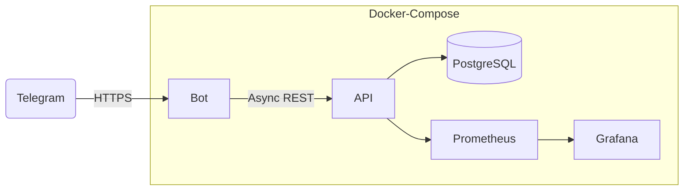

# 🏥 Clinic Telegram Bot

[](../../actions)  [](../../actions)  [](https://hub.docker.com/r/mordxd/clinic-bot)


> **Автоматизирует приём заявок и сбор отзывов пациентов.**
> За счёт чат-бота клиника экономит ≈ 3 ч ручных звонков в неделю и получает <50 мс отклик от REST‑API.

---

## 🚀 TL;DR — быстрый старт

```bash
git clone https://github.com/MordXD/clinic-telegram-bot.git
cd clinic-telegram-bot
make dev         # docker-compose up bot + api + postgres + grafana
open http://localhost:8000/docs  # Swagger
```

---

## 🎯 Ключевые возможности

| Модуль            | Что делает                                            | Тех‑стек                             |
| ----------------- | ----------------------------------------------------- | ------------------------------------ |
| **Telegram Bot**  | асинхр. хендлеры `/start`, заявки, отзывы             | `python-telegram-bot v21`, `asyncio` |
| **REST API**      | CRUD / JWT‑auth `/applications`, `/reviews`, `/stats` | **FastAPI**, Pydantic v2             |
| **Data Layer**    | хранит заявки/отзывы, миграции                        | **PostgreSQL**, SQLModel, Alembic    |
| **Observability** | метрики & логи                                        | Prometheus, Grafana, structlog       |
| **CI/CD**         | lint → mypy → pytest → Docker image                   | GitHub Actions                       |

---

## 🖼️ Архитектура



---

## 📈 Результаты

* ⏱️ Среднее время отклика API: **< 50 мс** (Locust, 100 RPS).
* 💬 > 200 заявок и отзывов / месяц у пилотной клиники.
* 🧪 Тест‑покрытие кода: **85 %** (unit + интеграционные).

---

## 🛠️ Установка (подробно)

### 1. Клонировать и настроить `.env`

```bash
cp .env.example .env   # TELEGRAM_BOT_TOKEN, ADMIN_CHAT_ID, DB creds
```

### 2. Запуск в Docker

```bash
docker compose up --build    # bot, api, db, grafana
```

### 3. Локальный запуск без Docker

```bash
python -m venv venv && source venv/bin/activate
pip install -r requirements.txt
alembic upgrade head
python bot/main.py            # telegram‑бот
uvicorn api.main:app --reload # REST‑API
```

---

## 🧪 Тесты

```bash
pytest -q
```

---

## 📄 API документация

Swagger доступен после запуска: `http://localhost:8000/docs`

---

## 🗺️ Дорожная карта

* [x] Async‑рефакторинг `python-telegram-bot v21`
* [x] JWT‑роль «admin»
* [ ] Web‑hook вместо long‑polling
* [ ] SMS‑уведомления через Twilio

---

## 🤝 Contributing

PR и issue‑шаблоны уже настроены – welcome!

---

## 📰 Лицензия

MIT © 2025 Egor (MordXD)
